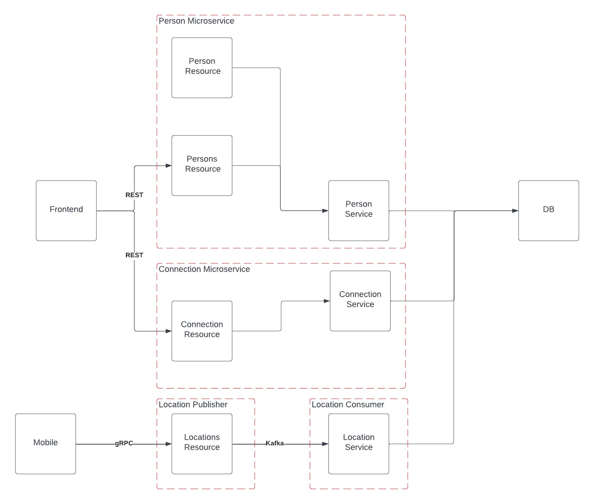

# UdaConnect Message Passing

## Architecture Design

## Architecture Decisions

1. The frontend will connect over HTTP using a REST endpoint this is industry standard and represents two microservices the person and connections microservices
2. The location data is more data intensive connections so will require to be connected over gRPC, 
3. There will be a queue enabled to process the location data before writing the db so we can handle scale

We will implement the strangler pattern but refactoring the connection microservice and replacing in the application. Then we can do the person and finally the location because that has the most things to implement.